# Тестирование API

## 1. Получение токена авторизации

### 1.1 Корректный логин и пароль (200 OK)
**Запрос:** 

**Params:** \-

**Authorization:** \-

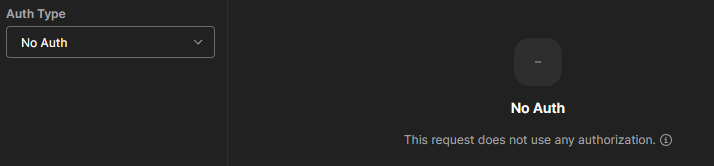

**Headers:** (Auto-generated)

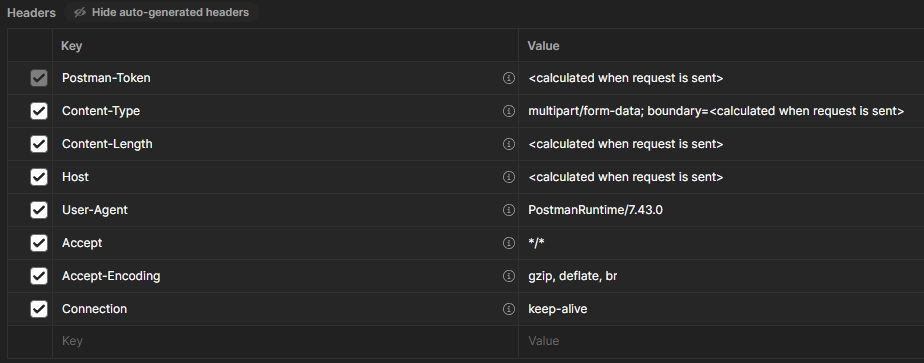

**Body:**

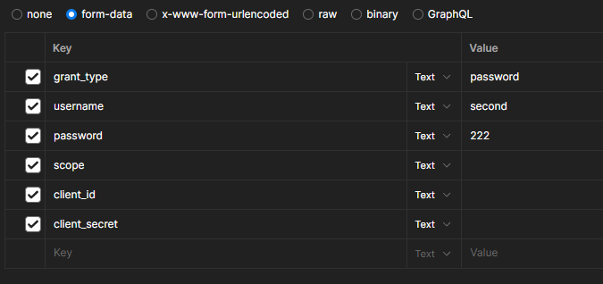

**Тесты:**

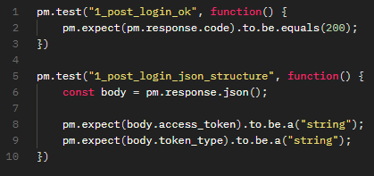

**Результаты тестирования:**

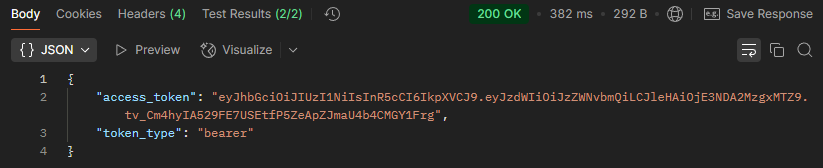

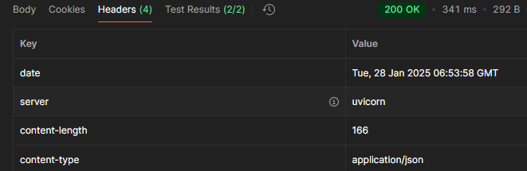

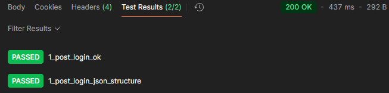

### 1.2 Некорректный логин и пароль (422 Validation Error)
**Запрос:** 

**Params:** \-

**Authorization:** \-

**Headers:** (Auto-generated)

**Body:**

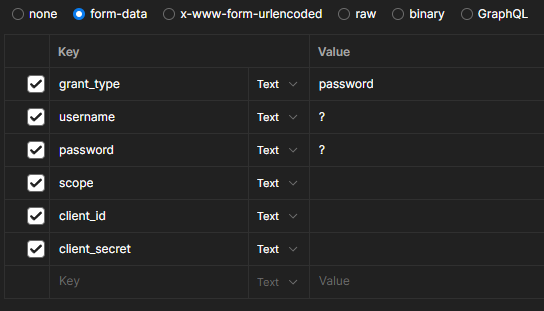

**Тесты:**

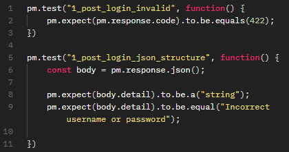

**Результаты тестирования:**

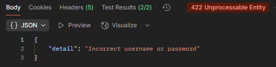

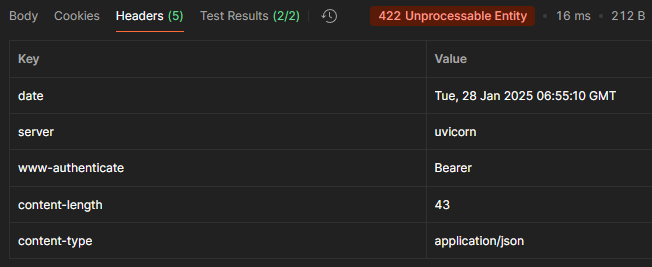

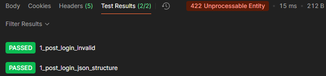

## 2. Cоздание задачи

### 2.1 Авторизация, корректные данные (200 OK)
**Запрос:** 

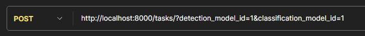

**Params:** 

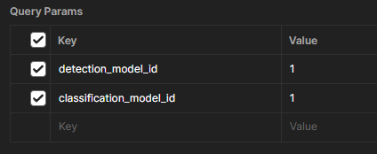

**Authorization:** 

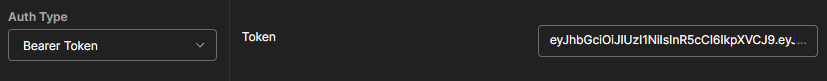

**Headers:** (Auto-generated)

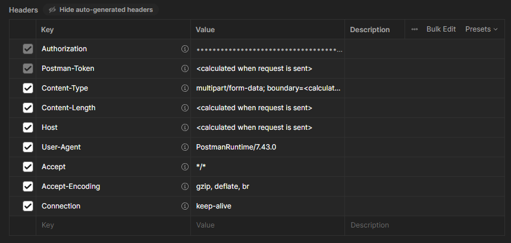

**Body:** image

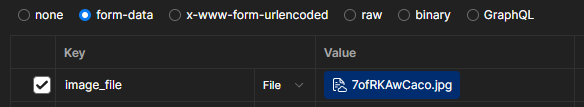

**Тесты:**

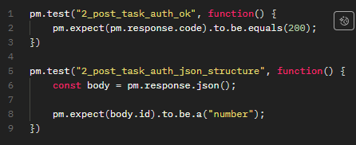

**Результаты тестирования:**

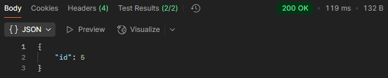

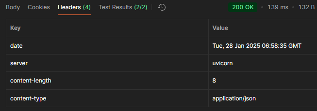

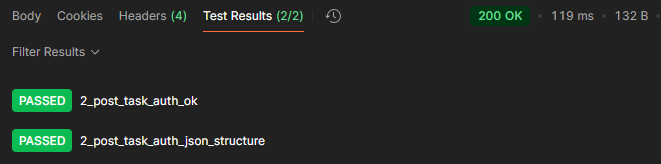

### 2.2 Авторизация, не корректные данные (400 Bad request)
**Запрос:** 

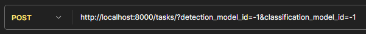

**Params:** 

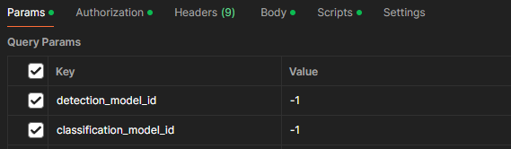

**Authorization:** 

**Headers:** (Auto-generated)

**Body:** image

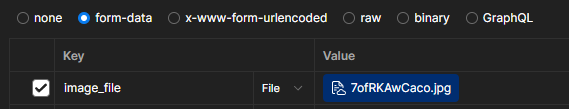

**Тесты:**

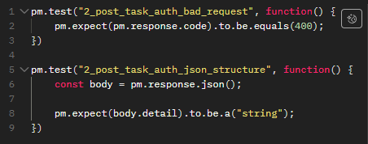

**Результаты тестирования:**

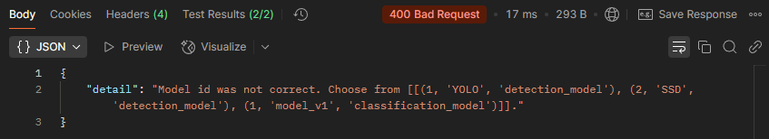

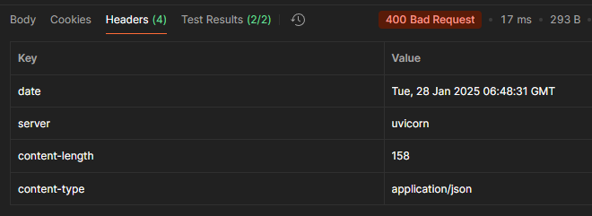

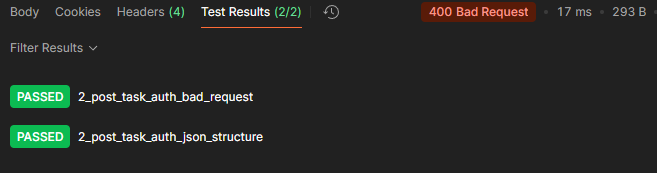

### 2.3 Нет авторизации, корректные данные (401 Unauthorized)
**Запрос:** 

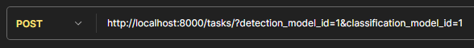

**Params:** 

**Authorization:**  \-

**Headers:** (Auto-generated)

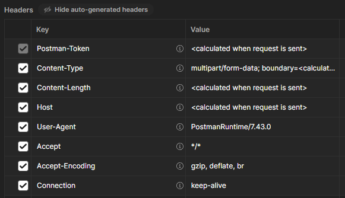

**Body:** 

**Тесты:**

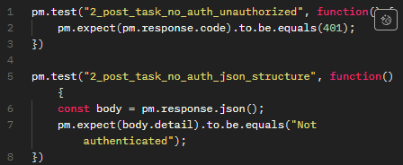

**Результаты тестирования:**

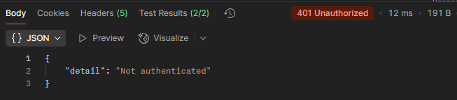

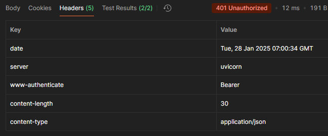

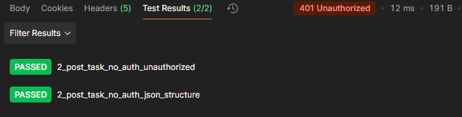

### 3. Получение списка задач

### 3.1 Авторизация, корректные данные (200 OK)

**Запрос:** 

**Params:** \-

**Authorization:** 

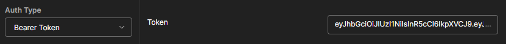

**Headers:** (Auto-generated) 

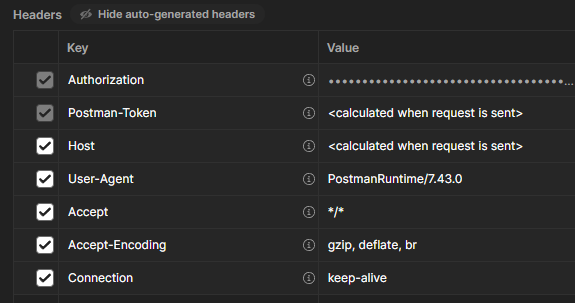

**Body:** \-

**Тесты:**

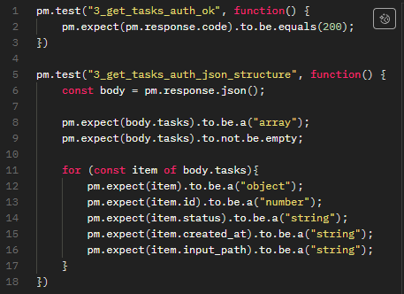

**Результаты тестирования:**

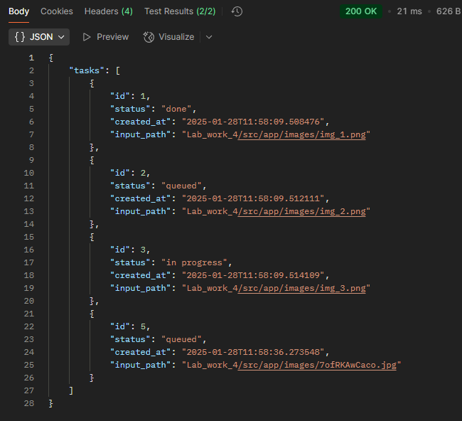

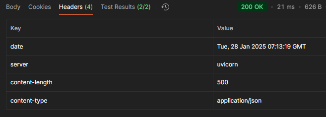

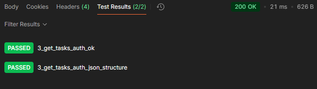

### 3.2 Нет авторизации, корректные данные (401 Unauthorized)

**Запрос:** 

**Params:** \-

**Authorization:** \-

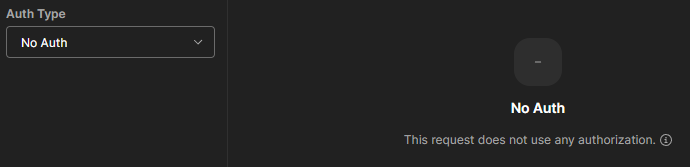

**Headers:** (Auto-generated)

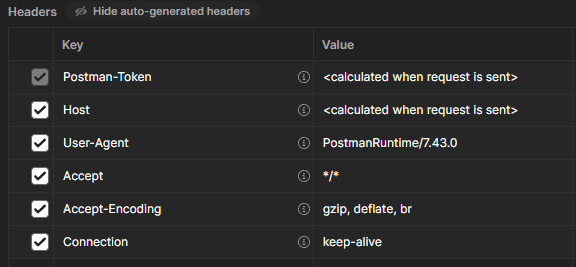

**Body:** \-

**Тесты:**

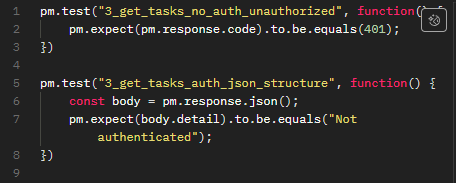

**Результаты тестирования:**

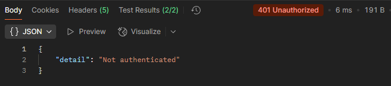

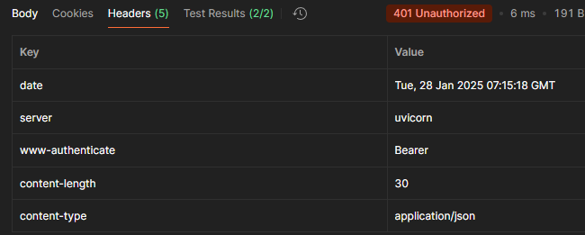

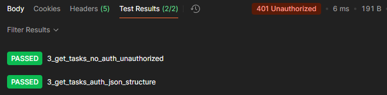

### 4. Получение статуса задачи

### 4.1 Авторизация, корректные данные (200 OK)

**Запрос:** 

**Params:** \-

**Authorization:**

**Headers:** (Auto-generated) 

**Body:** \-

**Тесты:**

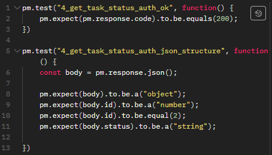

**Результаты тестирования:**

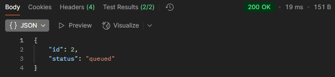

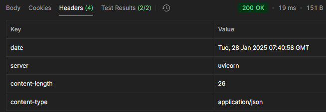

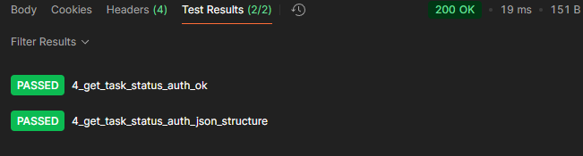

### 4.2 Авторизация, не корректные данные (404 Bad request)

**Запрос:** 

**Params:** \-

**Authorization:**

**Headers:** (Auto-generated)

**Body:** \-

**Тесты:**

**Результаты тестирования:**

### 4.3 Нет авторизации, корректные данные (401 Unauthorized)

**Запрос:** 

**Params:** \-

**Authorization:** \-

**Headers:** (Auto-generated)

**Body:** \-

**Тесты:**

**Результаты тестирования:**

### 5. Получение входных данных задачи

### 5.1 Авторизация, корректные данные (200 OK)

**Запрос:** 

**Params:** \-

**Authorization:** 

**Headers:** (Auto-generated)

**Body:** \-

**Тесты:**

**Результаты тестирования:**

### 5.2 Авторизация, не корректные данные (404 Bad request)

**Запрос:** 

**Params:** \-

**Authorization:** 

**Headers:** (Auto-generated) 

**Body:** \-

**Тесты:**

**Результаты тестирования:**

### 5.3 Нет авторизации, корректные данные (401 Unauthorized)

**Запрос:** 

**Params:** \-

**Authorization:** \-

**Headers:** (Auto-generated)

**Body:** \-

**Тесты:**

**Результаты тестирования:**

### 6. Получение результата задачи (предсказание)

### 6.1 Авторизация, корректные данные (200 OK)

**Запрос:** 

**Params:** \-

**Authorization:** 

**Headers:** (Auto-generated) 

**Body:** \-

**Тесты:**

**Результаты тестирования:**

### 6.2 Авторизация, не корректные данные (404 Bad request)

**Запрос:** 

**Params:** \-

**Authorization:** 

**Headers:** (Auto-generated) 

**Body:** \-

**Тесты:**

**Результаты тестирования:**

### 6.3 Нет авторизации, корректные данные (401 Unauthorized)

**Запрос:** 

**Params:** \-

**Authorization:** \-

**Headers:** (Auto-generated)

**Body:** \-

**Тесты:**

**Результаты тестирования:**

### 7. Получение списка моделей

### 7.1 Авторизация, корректные данные (200 OK)

**Запрос:** 

**Params:** \-

**Authorization:** 

**Headers:** (Auto-generated)

**Body:** \-

**Тесты:**

**Результаты тестирования:**

### 7.2 Нет авторизации, корректные данные (401 Unauthorized)

**Запрос:** 

**Params:** \-

**Authorization:** \-

**Headers:** (Auto-generated)

**Body:** \-

**Тесты:**

**Результаты тестирования:**

### 8. Удаление задачи 

### 8.1 Авторизация, корректные данные (200 OK)

**Запрос:** 

**Params:** \-

**Authorization:** 

**Headers:** (Auto-generated) 

**Body:** \-

**Тесты:**

**Результаты тестирования:**

### 8.2 Авторизация, не корректные данные (404 Bad request)

**Запрос:** 

**Params:** \-

**Authorization:** 

**Headers:** (Auto-generated)

**Body:** \-

**Тесты:**

**Результаты тестирования:**

### 8.3 Нет авторизации, корректные данные (401 Unauthorized)

**Запрос:** 

**Params:** \-

**Authorization:** \-

**Headers:** (Auto-generated)

**Body:** \-

**Тесты:**

**Результаты тестирования:**

### Общие результаты тестирования

### Общие результаты работы сервера

