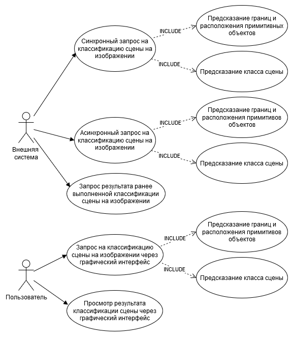
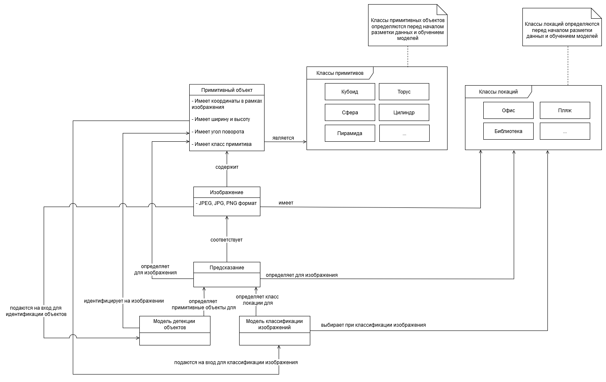
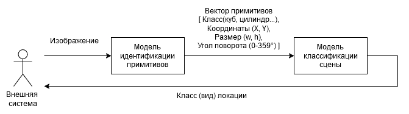
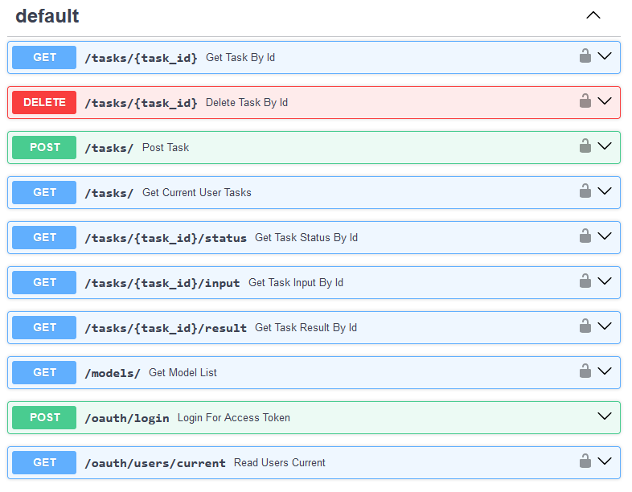
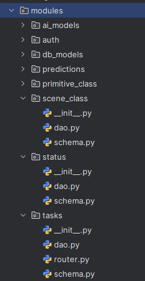
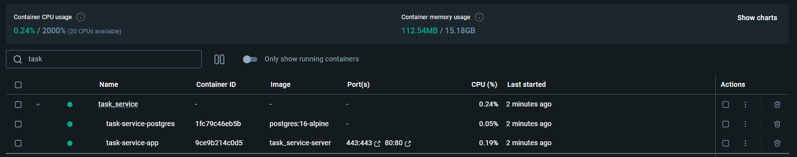
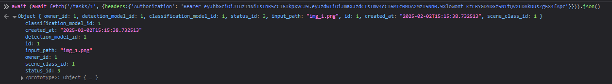
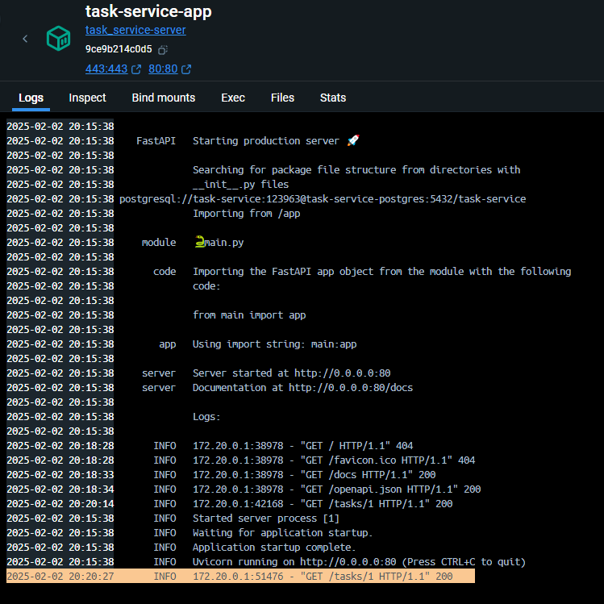

# Тема
Система моделей для идентификации примитивов и классификации сцен на изображениях

# Требования

## Прецеденты использования
1. Пользователь запрашивает *классификацию сцены на изображении* через графический интерфейс.
2. Пользователь просматривает результат *классификации сцены на изображении* через графический интерфейс.
3. Внешняя система синхронно запрашивает *классификацию сцены на изображении*.
4. Внешняя система асинхронно запрашивает *классификацию сцены на изображении*. 
5. Внешняя система запрашивает результат ранее выполненной *классификации сцены на изображении*.



## Функциональные требования

1. Система получает на вход *изображение* и выполняет задачи *идентификации примитивов*
и *классификации сцены на изображении* и возвращает на выход список *примитивов* на изображении и *класс сцены* изображения.
2. Система предоставляет механизм для синхронной работы, т.е. канал связи для запроса остаётся открытым и заблокированным до завершения запроса.
3. Система предоставляет механизм для асинхронной работы, т.е. запрос и его результат могут быть получены через разные каналы связи. 
4. Система предоставляет возможность выбора комбинации *модели для идентификации примитивов* и *модели для классификации сцена на изображении*.

## Нефункциональные требования

1. Система реализует взаимодействие по протоколу HTTP.
2. Метрика качества реализованной системы составляет не менее 60% для одной из комбинаций моделей.
3. Система способна обрабатывать изображения в формате PNG и JPEG.
4. Система поддерживает использование технологии CUDA при работе в окружении с графическим ускорителем NVIDIA.
5. Система поддерживает работу в окружениях без графического ускорителя NVIDIA.
6. Среднее время выполнения запроса для одного изображения системой не должно превышать 10 секунд. 

# Выбор средств разработки

Для реализации серверной части приложения была выбрана библиотека FastAPI (Python).

Работа над приложением будет вестись двумя разработчиками в IDE Pycharm и в Visual Studio Code.

Для совместной разработки и контроля версий используется система GIT.

При разработке используется встроенный в среды разработки линтер и статический анализатор.


# Модель предметной области



(+см. [глоссарий](glossary.md))

# Входы и выходы моделей нейронных сетей системы



# API системы

## Список методов

1) Получение токена авторизации (POST)
2) Создание задачи (POST)
3) Получение списка задач (GET)
4) Получение статуса задачи (GET)
5) Получение входных данных задачи (GET)
6) Получение результата задачи (предсказания) (GET) 
7) Получение списка моделей (GET)
8) Удаление задачи (DELETE)



## Документация API

Описание методов, путей, возможных кодов ответа представлено в документе - [API_documentation.md](API_documentation.md)

## Тестирование методов API

Описание тестов и результатов тестирования всех методов и всех кодов ответов для методов, в соответствии с документацией API, представлено в документе - [Postman_api_tests.md](Postman_api_tests.md)

JSON файл с тестами Postman - [HSE-CSSD-Python.postman_collection.json](HSE-CSSD-Python.postman_collection.json)

# База данных

Для хранения данных системы на сервере была выбрана СУБД PostgreSQL.

Схема базы данных:


При инициализации сервера [скрипт](https://github.com/Miraellax/HSE-CSSD-Python/blob/8c85865e74600223a76fb705e41c27220dea22bc/src/task_service/src/main.py#L16) создает необходимые таблицы и заполняет БД тестовыми данными для демонстрации работы методов. В дальнейшем при разработке системы добавление тестовых данных будет убрано.  

## Модели данных БД

На уровне приложения и на уровне хранения данных используется одна модель данных, так как выбрано использовать ORM подход библиотеки SQLAlchemy для работы с БД.

Для работы с данными из PostgreSQL внутри сервера FastAPI были созданы ORM [модели данных](https://github.com/Miraellax/HSE-CSSD-Python/blob/feat-practice_0/src/task_service/src/modules/db_models/models.py) с помощью библиотеки SqlAlchemy.

С помощью библиотеки Pydantic созданы схемы, описывающие необходимые поля данных получения и загрузки в БД данных.

Для каждой сущности в БД создана соотвутствующая папка в "modules", содержащая файл роутера FastAPi "router.py" (при наличии), схему данных "schema.py" (Pydantic), функции запросов для взаимодействия с БД с помощью моделей данных SqlAlchemy "dao.py".

Пример:




# Docker контейнер

Сервер FastAPI изолирован в отдельный сервис, для него создан образ докер-контейнера [task_service](../src/task_service).

Добавлен файл [docker-compose](../src/task_service/docker-compose.yaml) для запуска сервиса FastAPI вместе с БД.

Для запуска контейнеров необходимо выполнить команду ```docker-compose up``` из папки "HSE-CSSD-Python\src\task_service".

Результат запуска контейнеров:



Результат запроса к контейнеру с сервером:




