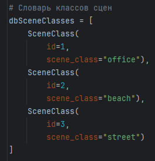
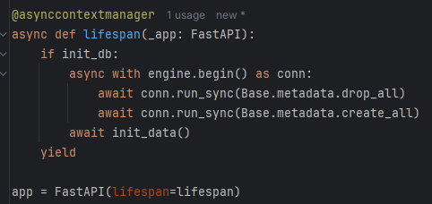
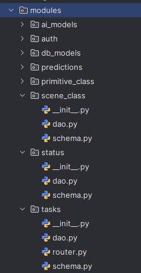

# Тема
Система моделей для идентификации примитивов и классификации сцен на изображениях

## Подключение СУБД

### Синхронное подключение
При выполнении практики practice_0 было реализовано синхронное подключение к базе данных PostgreSQL:


Файл переменных окружения .env хранит в себе необходимые данные для подключения (пароль, логин, порт...):
```
POSTGRES_USER=postgres
POSTGRES_PASSWORD=123963
POSTGRES_HOST=localhost
POSTGRES_PORT=5432
POSTGRES_NAME=hse_architecture
APP_HOST_PORT=80
```

Функция get_db() отвечает за получение сессии подключения для выполнения запросов к данным.

В рамках практической работы при запуске системы происходит создание всех таблиц БД и добавление тестовых данных для демонстрации возможностей системы и тестирования методов. Далее при разработке это будет убрано.

Таблицы БД описаны с помощью моделей SQLAlchemy ORM (см. practice_0) в файле models.py. При инициализации данных тестовые данные создаются как объекты моделей:



И далее загружаются в БД при запуске сервера FastAPI:


Важно учитывать порядок загрузки данных в БД - сначала необходимо загрузить данные в словари (классы сцен, классы примитивов), а потом создать объекты, ссылающиеся на эти данные внешними ключами (например, объект Предсказания, содержащий внешние ключи Типа сцены и Типов примитивных объектов).

### Асинхронное подключение
При выполнении текущей практики подключение к БД изменено на асинхронное - адрес подключения изменен с ```postgresql``` на ```postgresql+asyncpg```, используются асинхронные версии создания движка и сессии:


Переменные в .env не изменены. Функция получения get_db() сессии изменена на асинхронную.

Для инициализации таблиц в БД и тестовых данных асинхронно создана функция lifespan с декоратором @asynccontextmanager, позволяющая инициализировать БД и запускать сервер uvicorn в одном лупе:



(Без данной функции возникала проблема с конфликтующими лупами - запуск сервера и инициализация БД.)

Принцип инициализации данных не изменился - сначала идет загрузка словарей, потом данных, ссылающихся на них. 

Функция создания тестовых данных становится асинхронной и ожидает (await) выполнение задач, связанных с загрузкой данных в БД.


## Async-runtime

### База данных и FastAPI сервер

См. выше в Асинхронном подключении БД

### Запросы к БД

Во всех файлах dao.py модулей системы функции запросов к БД (GET, POST, DELETE...) изменены на асинхронные варианты.

Теперь функции на вход ожидают получить асинхронную сессию подключения к БД - AsyncSession.

GET запрос к данным выполняется с помощью функции sqlalchemy.select. Асинхронный запрос к БД выполняется с помощью .execute() и ожидается (await), единственный объект результата получается с помощью .scalar(), список объектов - .scalars.all(). 

Пример с получением единственного объекта:


Пример с получением списка объектов:


Для POST и DELETE запросов происходит ожидание коммита изменений (await db.commit()) и получения обновленных данных добавленного объекта (await db.refresh()).

Пример ожидания взаимодействия с БД:


### Роутеры

Для ожидания асинхронных запросов к бд (dao.py) функции эндпоинтов изменены на асинхронные (async), результат выполнения запроса ожидается с помощью await.

Сессия подключения к БД типа AsyncSession получается с помощью Depends вызовом измененной ранее функцией get_db.


### Тестирование изменений

После изменения типа подключения к БД и запросов на асинхронные варианты, было проведено тестирование эндпоинтов и кодов ответов с помощью созданной в practice_0 коллекции тестов Postman.

В ходе тестирования выявлены и исправлены некоторые ошибки. Успешные результаты тестирования:


## Выделение слоев DSS

### Фреймворк 
(api endpoints, console app, etc.)

При проектировании системы выбрана микросервисная архитектура. 
Пользователи (через графический интерфейс) и внешние системы взаимодействуют с сервером системы для создания задач и просмотра результатов.

C4 - Context:


C4 - Container:


C4 - Components (interface):


Сервер системы взаимодействует с БД и с сервисами Моделей нейросетей для обработки изображений.

C4 - Components (models):


**Консольное приложение** не позволит обращаться сразу нескольким Пользователям к серверу с Моделями нейросетей, поэтом данный вариант не подходит. 
Система может быть развернута локально на устройстве, но Модели нейросетей могут быть требовательны к вычислительным ресурсам, поэтому система разрабатывается с предположением, что Модели нейросетей будут разворачиваться на удаленном (мощном) сервере.

Таким образом, для реализации системы и сервера, взаимодействующего с Пользователями/Внешними системами и с Моделями нейросетей выбрана архитектура **api endpoints**.

Так как Модели нейросетей и система разрабатываются на языке Python - для реализации API выбран фреймворк **FastAPI**.
___
Добавление роутеров разных модулей (Tasks, Auth..) и запуск сервера FastAPI происходит в файле [main.py]() при исполнении файла/при запуске Docker-контейнеров или с помощью команды ```# fastapi run src/app/main.py```.


Список эндпоинтов API:
1) Получение токена авторизации (POST)
2) Создание задачи (POST)
3) Получение списка задач (GET)
4) Получение статуса задачи (GET)
5) Получение входных данных задачи (GET)
6) Получение результата задачи (предсказания) (GET) 
7) Получение списка моделей (GET)
8) Удаление задачи (DELETE)

Описание методов, путей, возможных кодов ответа представлено в документе - [API_documentation.md](API_documentation.md)

### Application
На уровне приложения и на уровне хранения данных используется одна модель данных, так как выбран ORM подход библиотеки SQLAlchemy для работы с БД.

Для работы с данными из PostgreSQL внутри сервера FastAPI были созданы ORM [модели данных](https://github.com/Miraellax/HSE-CSSD-Python/blob/feat-practice_0/src/task_service/src/modules/db_models/models.py) с помощью библиотеки SqlAlchemy.


С помощью библиотеки Pydantic созданы схемы, описывающие необходимые поля данных получения данных из БД и для их загрузки в БД.


Для каждой сущности в БД создана соотвутствующая папка в "modules", содержащая файл роутера FastAPi "router.py" (при наличии), схему данных "schema.py" (Pydantic), функции запросов для взаимодействия с БД с помощью моделей данных SqlAlchemy "dao.py".

Пример:



Функции запросов к БД, описанные в соответствующем сущности файле dao.py, используют DTO для работы с данными:
1. При получении данных из БД объект приводится к классу модели SQLAlchemy ORM. (dao.py) 


2. При возвращении данных роутером из БД, объект из класса модели SQLAlchemy ORM приводится к классу схемы Pydantic - Task, полный набор полей. (router.py, schema.py) 


3. При создании объекта и загрузке его в БД роутер создает объект класса схемы Pydantic - TaskCreate, только необходимые для создания поля. (schema.py) 


### Domain 

Было принято решение не использовать **CQRS** подход для разделения операций чтения и записи, так как нагрузка между ними мало отличается.

В основных сценариях использования системы пользователь/внешняя система создают задачу детекции и просматривают ее результат, когда он появится. В среднем, создание задачи (запись) и чтение результата (чтение) будут происходить в пропорциях 1 к 1. 

Повторное чтение результата ранее созданной задачи может происходить, но не ожидается, что функция будет очень популярной - предполагается, что система будет использована для обработки изображений в реальном времени.

### Infrastructure

#### Репозиторий

Репозиторий имеет структуру, рассчитанную на микросервисы - каждый микросервис имеет свою папку с названием сервиса (например, task_service), файлы docker-compose, dockerfile для контейнеризации. 

Далее при разработке системы дополнительные сервисы (например, Модели нейросетей) будут также добавляться в папку src.


Так как основным сервером является FastAPI сервер в файле task_service/src/main.py и приложение запускается из него - все пути к используемым пакетам и файлам .py импортируются с помощью путей, относительных данному файлу:


Импорты между модулями и пакетами также относительны:


#### Внешние сервисы

В рамках системы доступ к внешним сервисам не требуется.

#### СУБД

При разработке системы используется СУБД PostgreSQL, библиотека SQLAlchmemy ORM. Создание ORM моделей данных для работы с БД описано выше (см. Подключение СУБД).

В рамках системы доступ к БД реализован через Docker-контейнер с СУБД (см. Контейнеризация).


## Тестирование системы

### Тестирование API
В рамках практики practice_0 была разработана коллекция тестов в Postman для тестирования эндпоинтов API и возможных кодов ответов (см. Тестирование методов API).

После изменения функций с синхронных на асинхронные, тестирование было проведено повторно - ошибок нет (см. Тестирование изменений).

### Тестирование кода

...

## Контейнеризация

Сервер FastAPI изолирован в отдельный сервис, для него создан образ докер-контейнера [task_service](../src/task_service).

Добавлены файлы [docker-compose](../src/task_service/docker-compose.yaml) и [dockerfile]() для запуска сервиса FastAPI вместе с БД (PostrgeSQL).

Для запуска контейнеров необходимо выполнить команду ```docker-compose up``` из папки "HSE-CSSD-Python\src\task_service".

Результат запуска контейнеров:


Результат запроса к контейнеру с сервером:


