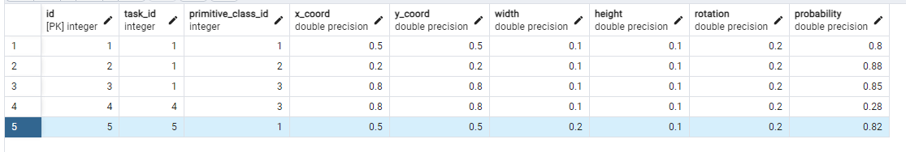

# Тема
Система моделей для идентификации примитивов и классификации сцен на изображениях

## Определение API DSS

**RPC / Event-based**

Мы решили выбрать "event based" архитектуру, так как с таким способом проще расширять систему - мы создаем множество задач на обработку в сервере, а модельки сами будут потихоньку их брать и обрабатывать, возвращать результаты. 

В теории мы можем развернуть 15 моделей детекции для более быстрой обработки большого потока задач, какая-нибудь из свободных моделей будет брать задачу и обрабатывать. 

Плюс, так как сервисы выполняют длительные задачи (детекция потенциально длительная задача, может быть и 1 сек, и 1 мин), мы не хотим держать соединение открытым, как в RPC.

## Разделение системы на сервисы

Система будет иметь основной FastAPI сервер для взаимодействия с внешними системами и пользователями и 2 сервиса с моделями, детекции и классификации.

C4 - Components:


(От "Модели предсказания", выделенной в practice_1 прослойкой между "Контроллером FastAPI" и контейнерами моделей было решено отказаться, так как ее функционал выполняется "Контроллером")

### Эндпоинты FastAPI сервера:
1) Получение токена авторизации (POST)
2) Создание задачи (POST)
3) Получение списка задач (GET)
4) Получение статуса задачи (GET)
5) Получение входных данных задачи (GET)
6) Получение результата задачи (предсказания) (GET) 
7) Получение списка моделей (GET)
8) Удаление задачи (DELETE)

### Эндпоинты модели детекции:
1) Получение предсказания примитивных объектов изображения (GET)

### Эндпоинты модели классификации:
1) Получение предсказания класса изображения (GET)

## Контейнеризация сервисов моделей 
Файл docker-compose был обновлен и теперь имеет следующие контейнеры:
- Основной сервер FastAPI
- Сервис модели детекции
- База данных Postgres
- Сервис Apache Kafka (Confluence)
- (Сервис init-kafka для инициализации топиков)

Сервис модели классификации будет работать по аналогичному сервису детекции принципу, пока находится в разработке.

Результат запуска контейнеров:


## Настройка Apache Kafka
В основном **продюсером** сообщений о задачах будет основной сервер FastAPI, а **консьюмерами** - модели детекции и классификации, принимающие задачи на обработку.

Но модели детекции и классификации также будут **продюсерами** сообщений с результатами обработки, а основной сервер будет **консьюмером** для принятия результатов и записи данных в БД.

### Отправка сообщения от сервера к моделям
Для создания сообщений от сервера для сервисов моделей в асинхронном режиме создан класс AsyncProducer (ссылка).
```python
class AsyncProducer:
    def __init__(self, configs):
        self._producer = Producer(configs)
        self._cancelled = False
        self._poll_thread = Thread(target=self._poll_loop)
        self._poll_thread.start()

    def _poll_loop(self):
        while not self._cancelled:
            self._producer.poll(2.0)

    def close(self):
        self._cancelled = True
        self._poll_thread.join()

    def produce(self, topic, value, loop):
        """
        An awaitable produce method.
        """
        result = loop.create_future()

        def delivery_callback(err, msg):
            if err:
                loop.call_soon_threadsafe(result.set_exception, KafkaException(err))
            elif msg.error():
                loop.call_soon_threadsafe(result.set_exception, KafkaException(msg.error()))
            else:
                loop.call_soon_threadsafe(result.set_result, msg)

        self._producer.produce(topic, value, on_delivery=delivery_callback)
        return result
```

Адрес для подключения продьюсера хранится в env переменной и подгружается при запуске скрипта:
```python
dotenv.load_dotenv()

KAFKA_BOOTSTRAP_SERVERS = os.getenv("KAFKA_BOOTSTRAP_SERVERS")

config = {
        'bootstrap.servers': KAFKA_BOOTSTRAP_SERVERS,

        # Fixed properties
        'acks': 'all'
    }

producer = AsyncProducer(configs=config)
```

Созданы 4 топика для разных типов сообщений:
- "detect-primitives" (задачи на обработку моделью детекции)
- "classify-image" (задачи на обработку моделью классификации)
- "detected-primitives" (результаты детекции)
- "classified-image" (результаты классификации)

Для отправки сообщений с данными для обработки (изображение или вектор примитивов) созданы функции:
```python
async def dispatch_task_detect_primitives(task_id: bytes, image: bytes, loop):
    result = await producer.produce(topic=topic_detect_primitives, value=task_id+image, loop=loop)
    return result

async def dispatch_task_detected_primitives(image):
    pass
```

Для создания задачи в роутере FastAPI изменена функция post_task (ссылка). 
1. После загрузки пользователем изображения, оно сохраняется локально на сервере.
2. В базе данных создается Задача, при успехе возвращается ID задачи в БД.
3. Изображение преобразуется в байт-строку и отправляется сообщением модели детекции. Сообщение содержит айди задачи в формате байт-строки указанной в env длины и байт-строки самого изображения.
4. Запрос возвращает код ответа пользователю.

Сообщение отправляется только если удалось создать Задачу в базе данных:
```python
# SEND task to detection model via Kafka and await the sending
        try:
            await dispatch_task_detect_primitives(task_id=task.id.to_bytes(TASK_ID_BYTE_SIZE),
                                                          image=read_image(input_path),
                                                          loop=asyncio.get_event_loop())
        except Exception:
            # Delete task that was not sent to detection
            await task_dao.delete_task(db=db, task=task)
            raise HTTPException(status_code=500, detail=f"The task cannot be sent to the detection model, it was not saved in the DB.")
```

### Обработка сообщения о задаче моделью детекции
Для приемки сообщений моделью в топике "detect-primitives" создается консьюмер, подписанный на необходимый топик (ссылка). Адрес для подключения также берется из env переменной.

```python
dotenv.load_dotenv("../../task_service/.env")

KAFKA_BOOTSTRAP_SERVERS = os.getenv("KAFKA_BOOTSTRAP_SERVERS")

config = {
    # User-specific properties that you must set
    'bootstrap.servers': KAFKA_BOOTSTRAP_SERVERS,

    # Fixed properties
    'group.id': 'detection-model',
    'auto.offset.reset': 'earliest'
}

# Create Consumer instance
consumer = Consumer(config)

# Топик для задач, требующих детекцию примитивов моделью детекции
topic_detect_primitives = "detect-primitives"

consumer.subscribe([topic_detect_primitives])
```

Так как при импорте файла консьюмер уже создается, создана функция для возврата существующего экземпляра:
```python
def get_consumer():
    return consumer
```

Основной выполняемой функцией в сервисе модели будет асинхронный main():

```python
TASK_ID_BYTE_SIZE = int(os.getenv("TASK_ID_BYTE_SIZE"))

async def main():
    consumer = get_consumer()

    try:
        while True:
            msg = consumer.poll(10.0)
            if msg is None:
                print("Waiting...")
            elif msg.error():
                print("ERROR: %s".format(msg.error()))
            else:
                # Extract the (optional) key and value, and print.
                print("Consumed event from topic {topic}.".format(topic=msg.topic()))

                # Получаем айди задачи для отправки результата обратно и изображение для обработки
                task_id, image_bytes = msg.value()[0:TASK_ID_BYTE_SIZE], msg.value()[TASK_ID_BYTE_SIZE:]

                # Обработка изображения
                result = await process(image_bytes)
                print(f"DETECTION MODEL RESULT for task_id({int.from_bytes(task_id)}):", result)

                # Отправка результата обратно на сервер
                answ = await dispatch_task_detected_primitives(task_id=task_id, result=json.dumps(result).encode("utf-8"), loop=asyncio.get_event_loop())
    except KeyboardInterrupt:
        pass
    finally:
        # Leave group and commit final offsets
        consumer.close()

asyncio.run(main())
```

Модель проверяет своего консьюмера на наличие сообщений while True. 

При появлении сообщения в консоль выводится уведомление (для дебага), а само сообщение разделяется на ID Задачи и байт-строку изображения. 

Для определения длины байт-строки ID задачи используется env переменная, использовавшаяся для кодирования.

После получения изображения, вызывается функция обработки, возвращающая на данный момент пример данных (ссылка):
```python
async def process(image: bytes) -> list[dict]:
    # mock results for now, class is class id
    results = [
        {
            "class_id": 1,
             "x_coord": 0.5,
             "y_coord": 0.5,
             "width": 0.2,
             "height": 0.1,
             "rotation": 0.2,
             "probability": 0.82
        }
    ]

    return results
```

Результат работы модели преобразуется в JSON и передается с айди соответствующей задачи как строка в сообщении для сервера.

### Отправка результата от модели детекции на сервер
Для возврата результата обработки изображения в асинхронном режиме сервис моели выступает в роли продьюсера.

Моделью используется аналогичный асинхронный продьюсер, но функция отправки сообщения использует топик "detected-primitives", который прослушивается сервером:
```python

# Топик для задач с результатами детекции примитивов от модели детекции
topic_detected_primitives = "detected-primitives"

# task_id length = .env/TASK_ID_BYTE_SIZE
async def dispatch_task_detected_primitives(task_id: bytes, result: bytes, loop):
    result = await producer.produce(topic=topic_detected_primitives, value=task_id + result, loop=loop)
    return result

```

Для генерации future, который будет принадлежать event_loop'у основного потока в функцию dispatch_... передается loop основного сервера FastAPI. Обработка успешности отправки сообщения происходит в нем. 

### Получение результатов модели на сервере
Для получения результатов от моделей детекции и классификации на сервере FastAPI создан консьюмер, подписанный на два соответствующих топика - "detected-primitives" и "classified-image" (ссылка).

Было сложно, но мы смогли ~~наделать костылей~~ создать обработчик сообщений server_consumer (ссылка):
```python
async def server_consumer(main_loop):
    consumer = get_consumer()

    try:
        while True:
            msg = consumer.poll(10.0)
            if msg is None:
                print("Waiting...")
            elif msg.error():
                print("ERROR: %s".format(msg.error()))
            else:
                print("Consumed event from topic {topic}.".format(topic=msg.topic()))

                # Обработка результатов детекции
                if msg.topic() == "detected-primitives":
                    # Получаем айди задачи и результат
                    task_id, result = int.from_bytes(msg.value()[0:TASK_ID_BYTE_SIZE]), (msg.value()[TASK_ID_BYTE_SIZE:]).decode("utf-8")
                    print(f"SERVER GOT DETECTION MODEL RESULT for task_id({task_id}):", result)

                    # Загрузка результата в БД по айди задачи
                    result_dicts = json.loads(result)
                    print(result_dicts)
                    preds = [
                        prediction_schema.PredictionCreate(
                            task_id=task_id,
                            primitive_class_id=pred["class_id"],
                            x_coord=pred["x_coord"],
                            y_coord=pred["y_coord"],
                            width=pred["width"],
                            height=pred["height"],
                            rotation=pred["rotation"],
                            probability=pred["probability"]
                    ) for pred in result_dicts]
    
                    async def load_predictions():
                        async with get_db_session() as ses:
                            await post_predictions(db=ses, predictions=preds)

                    asyncio.ensure_future(load_predictions(), loop=main_loop)
                    # TODO вызывать классификацию

                # TODO Обработка результатов классификации
                elif msg.topic() == "classified-image":
                    # Получаем айди задачи и результат
                    task_id, result_bytes = msg.value()[0:TASK_ID_BYTE_SIZE], msg.value()[TASK_ID_BYTE_SIZE:]
                    print(f"SERVER GOT CLASSIFICATION MODEL RESULT for task_id({int.from_bytes(task_id)}):",
                          result_bytes.decode("utf-8"))

                    # TODO загрузить результаты классов для задачи в БД, обновить статус задачи на "сделано"

    except KeyboardInterrupt:
        pass
    finally:
        # Leave group and commit final offsets
        consumer.close()
```

Так как основной поток FastAPI сервера занят сервером uvicorn, консьюмер сообщений был развернут в отдельном потоке в функции lifespan:
```python
@asynccontextmanager
async def lifespan(_app: FastAPI):
    if init_db:
        async with engine.begin() as conn:
            await conn.run_sync(Base.metadata.drop_all)
            await conn.run_sync(Base.metadata.create_all)
        await init_data()

    current_loop = asyncio.get_running_loop()
    consumer_thread = Thread(target=lambda: asyncio.run(server_consumer(current_loop)))
    consumer_thread.start()

    yield
    sp.close_producer()
```
После завершения работы приложения продьюсер закрывается.

Функция консьюмера while True считывает получаемые сообщения из двух потоков и обрабатывает их в зависимости от типа:
1. Полученные объекты детекции загружаются в БД и вызывается задача классификации.
2. Полученные классы изображения будут загружены в БД и статус задачи изменится на "выполнена".

Для корректной загрузки данных в БД (в правильном loop'е) future создается в основном потоке FastAPI сервера, который передается консьюмеру при запуске.
```python
async def load_predictions():
    async with get_db_session() as ses:
        await post_predictions(db=ses, predictions=preds)

asyncio.ensure_future(load_predictions(), loop=main_loop)
```

### Тестирование сообщений между сервером и моделью детекции
После развертывания контейнеров сообщения были протестированы.

"KAFKAAA..." указывает на момент отправки сервером сообщения для модели, передается изображение.

"SERVER GOT DETECTION MODEL RESULT..." - момент принятия сервером результатов от модели. В сообщении присутствует список словарей с примитивными объектами, далее загружаемый в БД:


Сервис модели детекции принимает сообщение от сервера:


На данном скрине добавлена загрузка данных в БД, после принятия сообщения присутствует соответствующий выполненный SQL запрос.


В результате запроса к серверу FastAPI изображение было передано сервису модели, результат вернулся серверу и был записан в БД:



## Тестирование системы
После добавления взаимодействия с сервисами в запрос на создание задачи и обработку изображения были запущены ранее созданные тесты API в Postman.

Тестирование метода POST create_task прошло успешно:


Успешный запуск контейнеров:


Успешная обработка сообщений и загрузка данных в БД:


