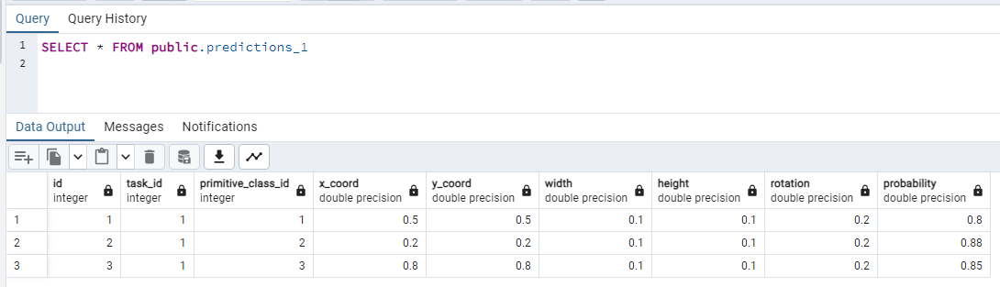

# Тема
Система моделей для идентификации примитивов и классификации сцен на изображениях

## Настройка CI
Для проверки корректности сборки и запуска проекта создана задача для сборки и подъема контейнеров сервера, модели и базы данных:


Задача успешно выполняется при пуше в ветки:


### Линтер
В качестве линтера в проекте выбран Pylint.

В результате анализа кода основного сервера (task_service/src/modules) были получены список предупреждений и оценка кода:


Далее при разработке проекта они будут исправлены.

В репозитории GitHub добавлено действие (Action) на проверку кода линтером:


Запуск задачи приводит к ее падению из-за количества стилистических ошибок в коде :)


Пример падения задачи:


### Статический анализатор
Статическим анализатором кода проекта выбран MyPy.

При запуске анализа проекта он находит некоторые ошибки типов:

Создано действие для проверки кода при пуше в ветку:


Оно также, как и в консоли, находит большое количество ошибок, о чем сообщает и падает:


### Автоматическое тестирование
Пока реализуется только в формате сборки и запуска контейнеров (Integration), как описано выше в действии Test-CI.


## Масштабирование компонентов
Для системы почти не актуальна балансировка нагрузки с репликацией БД или контейнеров моделей, так как для передачи сообщений используется Kafka, не способная динамически расширяться, подстраиваясь под репликацию.

Кеширование данных СУБД с помощью Redis будет мало эффективным. Результаты обработки изображений, предсказания объектов и классов будут либо сразу возвращаться пользователю, либо запрашиваться для просмотра только один раз в большинстве случаев (2 и более раз - возможно, но редко). Кеширование может быть использовано при неоднократном запросе словарных данных (классы изображений, классы объектов, значения моделей...), но прирост производительности скорее всего будет незначительным.

Шардирование СУБД в теории может сделать запросы к данным быстрее, но основная таблица с данными одна - предсказания. Ее разделение по пользователям может иметь смысл, но на текущей стадии проекта (проверка теории) больше чем 1-2 пользователя не планируется. Решено сделать шардирование таблицы предсказаний по хеш-коду айди предсказания, просто разделив таблицу на 4 фрагмента для более быстрого поиска задач с предсказаниями.


## Шардирование PostgreSQL
Для шардирования базы данных решено использовать встроенный механизм - создать 4 таблицы Предсказаний и передавать/запрашивать данные через обобщающую таблицу-сервер.

Были настроены миграции БД с Alembic, создана миграция инициализации БД с заполнением тестовых данных - [ссылка]().

На ее основе создан SQL скрипт (```alembic upgrade head --sql```) для создания таблиц и заполнения данных, скрипт отредактирован для создания внешних таблиц шардов и для серверов под них:

1. Разделение таблицы predictions на части (partitions) по столбцу task_id:


2. Создание трех серверов для внешних таблиц:


3. Создание внешних таблиц на соответствующих серверах, для таблиц выбраны значения task_id по остатку от деления на 4 (количество шардов):


4. Создание последней таблицы-шарда, находящейся на основном сервере:


5. Создание тестовых данных, включая таблицу predictions:


Пример полученных данных в основной таблице и в ее внешних таблицах-шардах:


Для создания трех контейнеров внешних серверов в [docker-compose]() добавлены соответствующие описания:


Основной сервер БД будет запускаться после создания контейнеров с шардами:


Описано создание необходимых вольюмов для БД:


В docker-compose описан запуск скриптов для инициализации БД, скрипты для основного сервера лежат в папке [db_migrations/leader]() и содержат полный [скрипт]() создания таблиц и внешних серверов, а для шардов лежат в папке [db_migrations/shard]() и содержат [скрипт]() для создания только таблиц prediction, т.к остальные не нужны.

В основном скрипте main.py закомментирован предыдущий вариант инициализации таблиц, теперь работают SQL скрипты при подьеме контейнеров:


## Тестирование шардирования
Контейнеры успешно запускаются:


При просмотре БД в pgadmin можно заметить созданные внешние таблицы, сервера и разделенную таблицу predictions:


Записи, добавляемые в основную таблицу predictions распределяются в шарды по task_id, так записи с task_id=1 были отправлены во внешнюю таблицу predictions_1:




___
При необходимости увеличить количество шардов таблицы - придется объединить существующие шарды в единую таблицу и заново распределить записи уже на большее количество шардов.

Например, сейчас реализовано разделение на 4 шарда, записи распределяются по остатку от деления на 4 (остаток 0 = 1я таблица, остаток 1 = 2я таблица и тд.), при создании 6 таблиц записи будут распределяться по остатку от деления на 6. Нельзя оставить предыдущие записи в таблицах 1-4, так как остаток от деления на 4 и на 6 будет различаться и в итоге распределение окажется неверным, не получится найти необходимые данные по запросу.

Нельзя сразу создать 8 таблиц, но распределять данные только по 4м таблицам (чтобы потом расшириться до 8ми) - так записи с остатками 0, 1, 2, 3 будут записаны в таблицы, а записи с остатками 4-7 будут просто потеряны.
